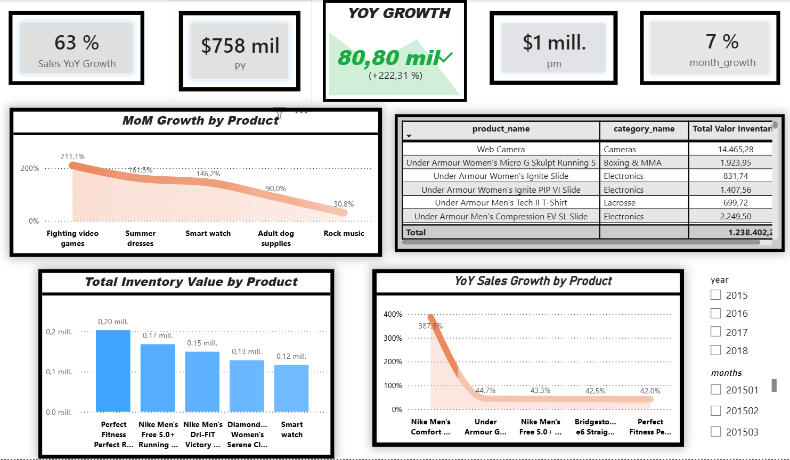

# 🚚 End-to-End Supply Chain Analytics Pipeline
### Python ETL | PostgreSQL Data Modeling | Advanced SQL Analytics | Power BI Dashboards

## 📌 Executive Summary
This repository presents a complete, production-grade supply chain data engineering and analytics solution using the **DataCo Supply Chain Dataset**. The pipeline cleans raw operational data, models it into an optimized **Star Schema** in PostgreSQL, runs complex business analytics queries, and visualizes KPIs across interactive Power BI dashboards.

---

## 🛠️ Tech Stack & Tools
* **Data Processing & ETL:** Python (`Pandas`, `NumPy`)
* **Database & Modeling:** PostgreSQL (Star Schema, DDL Constraints, Primary/Foreign Keys)
* **Analytical Querying:** Advanced SQL (`Window Functions`, `CTEs`, `HAVING`, `STRING_AGG`, `DENSE_RANK`, `LAG`)
* **Business Intelligence:** Power BI (DAX Measures, Data Modeling, Dynamic Dashboards)

---

## 🏗 Data Architecture & Star Schema

| Table Name | Type | Key Columns | Description |
| :--- | :--- | :--- | :--- |
| **`dim_customer`** | Dimension | `customer_id` (PK) | Stores normalized customer attributes (location, segment). |
| **`dim_product`** | Dimension | `product_card_id` (PK) | Contains product catalog details and categories. |
| **`fact_orders`** | Fact | `order_item_id` (PK), `customer_id` (FK), `product_card_id` (FK) | Stores transactional sales, shipping metrics, and profit margins. |

---

## 🔄 Pipeline Breakdown

### 1. Python ETL (`etl_pipeline.py`)
* Cleans invalid operational rows (negative shipping days, zero quantity).
* Normalizes dates and standardizes text casing.
* Handles missing data and duplicate key constraints.
* Exports clean normalized dimensions (`dim_customer.csv`, `dim_product.csv`) and fact dataset (`fact_orders.csv`).

### 2. Database DDL & Schema Setup (`schema_and_queries.sql`)
* Defines relational tables with `PRIMARY KEY`, `FOREIGN KEY` (`ON DELETE CASCADE`), and `CHECK` constraints (`late_risk IN (0, 1)`).
* Uses explicit numeric types (`NUMERIC(12, 2)`) to avoid precision errors in financial calculations.

### 3. Business Analytics & SQL Highlights
* **Logistics & SLA Violations:** Pinpoints product categories exceeding delivery SLAs by >= 1 day and identifies customers at highest risk.
* **Customer Lifetime & Retention:** Measures repurchase velocity (days between 1st and 2nd orders), MoM revenue growth, and continuous running totals using `LAG()` and `OVER()`.
* **Margin Leakage & Profit Risk:** Detects high-value orders generating negative profit margins (`benefit_per_order < 0`) and ranks top 3 revenue products per category using `DENSE_RANK()`.

---

## 📊 Power BI Dashboard Preview



### Key Metrics Visualized:
* **Total Sales & Profit Margins** segmented by region and customer tier.
* **On-Time vs. Late Shipping SLA Risk** breakdown across product categories.
* **Cross-Selling & Repurchase Velocity** patterns.

---

## 📂 Repository Structure

* `etl_pipeline.py` — Python script for data cleaning & CSV exports
* `schema_and_queries.sql` — DDL table creation scripts & 12 analytical SQL queries
* `power_bi_dashboard.pbix` — Interactive Power BI report file
* `dashboard_preview.png` — Screenshot preview for documentation
* `README.md` — Project documentation

---

## 📊 DAX Measures & Analytical Logic

This project leverages DAX (Data Analysis Expressions) to deliver key business metrics, performance indicators, and time-intelligence insights:

1. **Total Revenue**
   ```dax
   total revenue = SUM(fact_orders[sales])
Purpose: Calculates total direct sales revenue across all completed transactions.

2. **Total Valor Inventario (Total Inventory Value)**

```dax
Total Valor Inventario = 
SUMX(
    fact_orders,
    fact_orders[order_item_quantity] * RELATED(dim_product[product_price])
)
```
Purpose: Computes the total monetary value of ordered inventory row-by-row by multiplying order quantity with the product price fetched from the Product Dimension via RELATED().

3. **All Category Revenue**

```dax
all category revenue = CALCULATE([total revenue], ALL(dim_product[category_name]))
```
Purpose: Evaluates total revenue across all product categories by overriding existing category filters using ALL(). Serves as the benchmark baseline for market share metrics.

4. **Category Sales Contribution (%)**

```dax
category_sales_contribution = DIVIDE([total revenue], [all category revenue])
```
Purpose: Determines the percentage contribution of each product category to total sales. Uses DIVIDE() to safely handle zero-denominator exceptions.

5 **PM (Previous Month Value)**

```dax
pm = CALCULATE([Total Valor Inventario], DATEADD(dim_date[Date], -1, MONTH))
```
Purpose: Applies Time Intelligence (DATEADD) to extract inventory value from the prior month for MoM comparative analysis.

6. **PY (Previous Year Value)**

```dax
PY = CALCULATE([Total Valor Inventario], DATEADD(dim_date[Date], -1, YEAR))
```
Purpose: Retrieves the equivalent inventory value from the previous year to evaluate YoY trends.

7. **Month-over-Month Growth (MoM %)**

```dax
month_growth = DIVIDE([Total Valor Inventario] - [pm], [pm])
```
Purpose: Measures period-over-period percentage growth relative to the previous month.

8. **Year-over-Year Sales Growth (YoY %)**

```dax
Sales YoY Growth = DIVIDE([Total Valor Inventario] - [PY], [PY])
```
Purpose: Tracks annual performance momentum by calculating the year-over-year percentage variance in inventory value.
